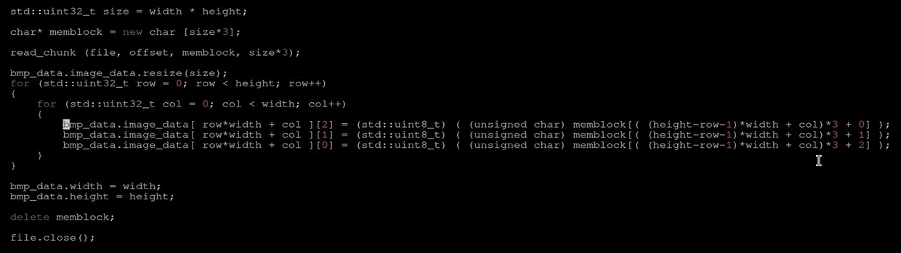
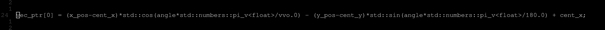
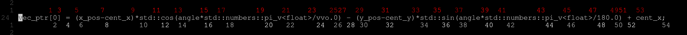
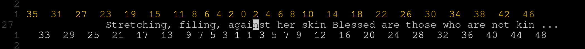

# cheat-line.nvim
***made with <3***



## Table of contence 

1. [Whats new?](#whats-new)
2. [Overview](#overview)
3. [Usage](#usage)
    1. [word-based](#word-based)
    2. [character-based](#character-based)
4. [Installation](#installation)
    1. [lazy](#lazy)
    2. [vim-plug (lua)](#vim-plug-lua)
    3. [vim-plug (vimscript)](#vim-plug-vimscript)
    4. [packer](#packer)
5. [Quick-start](#quick-start)
6. [Configuration](#configuration)
    1. [Default config](#default-config)
    2. [Line position](#line-position)
    3. [Highlight groups (built-in)](#highlight-groups-built-in)
    3. [Highlight groups (custom)](#highlight-groups-custom)

## What's new? 
* The plugin is now in LUA hooray!
* Fixed a bug with cheat-line not working if the number of lines in buffer is less then 3
* Fixed a bug with cheat-line going beyond window limits
* Added new highlight groups
* Added new operation mode

## Overview 
Cheat line is a very simple lua-based neovim plugin that helps with navigating within the currently 
selected line. By highlighting `pivot` points with numbers it helps you quickly travel to desired position in line.

*Are you tired of navigating humongous and hideous walls of C text mercilessly splattered on a single line?
Have you lost all hope in finding a robust way of traversing monstrosities like this one?*



***Fear not! For the solution have already been created! 
With new and improved cheat-lien.nvim TM you can leave your frustrations and sorrows behind!*** 



## Usage 

### Basic stuff

Run `:CheatLineToggle` to toggle the cheat-line  (or use built-in mapping `<leader>c`)

Run `:CheatLineSwitchOperationMode` to switch between word-based and character-based modes (or use built-in mapping `<leader>x`)

### Inner workings

Cheat line provides very convenient to use method for navigating within your current line
Cheat line has two main operation modes: **word-based** and **character-based** 

#### ***word-based***
For **word-based** mode cheat line highlights the beginning (or ending depending on your config) of each word in line just like this:


The numbers represent how many times you will have to press ***w*** or ***b*** to get to each highlighted point
So to get to the beginning of the word ***mushroom*** you'd enter **2b** to go 2 words backwards, pressing **4w** would get you to word ***day*** and so on

#### ***character-based***
**character-based** mode is very similar to **word-based** mode but instead of highlighting begging of each word it highlights characters in string just like this:




As in the **word-based** example numbers represent how many times you'll have to move to right or left (with **l** or **h** respectfully) to get to highlighted point
For example if you wish to go to letter **h** of the word **those** you'll need to press **28l** to go 28 characters to the right

### Commands

|Command | action |
| - | - |
| `CheatLineEnable` | Activates cheat-line |
| `CheatLineDisable` | Deactivates cheat-line |
| `CheatLineToggle` | Toggles cheat-line |
| `CheatLineSwitchPointingMode` | Change from pointing to the start of a word to the end of the word in character-based mode |
| `CheatLineSwitchOperationMode` | Switch cheat-line operation mode (between word-based and character-based)  |

## Installation

>[!NOTE]
>Neovim 0.7.0 or higher is required 

Use your plugin manager of choice to install *cheat-line.nvim*

Here are few examples:

### lazy

```
{
    "Vlazum/cheat-line.nvim",
    config = function ()
        require('cheat-line').setup({
        -- your options here
        })
    end
}
```

### vim-plug (lua)

```
local Plug = vim.fn['plug#']

vim.call('plug#begin')
Plug('Vlazum/cheat-line.nvim')
vim.call('plug#end')

require('cheat-line').setup({
	-- your options here
})
```

### vim-plug (vimscript)

```
call plug#begin()

Plug 'Vlazum/cheat-line.nvim'

call plug#end()

lua require('cheat-line').setup( {  } )
" your opts insede the braces     /\

```


### packer 

```
use {
        "Vlazum/cheat-line.nvim", 
        config = function ()
            require('cheat-line').setup({
            -- your options here
            })
        end
    }
```

>[!NOTE]
> Do note that calling setup() function is required for the plugin to function properly

## Quick-start 

This part is dedicated for minimal setup with minimal tinkering. Please refer to other paragraphs for more detailed information

You must run the **setup()** function for the plugin to work properly 

**It is also highly recommended for you to create mappings for quickly toggling cheat line**

The plugin has a default mappings (`<leader>c` for  `:CheatLineToggle` and `<leader>x` for `CheatLineSwitchOperationMode`) 
Default mappings can be disabled with option `enabl_default_mappings` set to `false`

It is still recommended to create some mappings even if you dislike the default ones

Here is an example mapping 

```
vim.keymap.set("n", "<leader>cc", "<CMD>CheatLineToggle<CR>", {silent = false})
vim.keymap.set("n", "<leader>cx", "<CMD>CheatLineSwitchOperationMode<CR>", {silent = false})
```

That's pretty much it! 
For deeper customization refer to later paragraphs 

## Configuration

### Default config

Here is a default configuration for cheat line 

```
opts = {
    operation_mode                = 1, -- 1: word-based    2: char-based
    cheat_line_op_mode_default    = 1,
    cheat_line_enabled            = false,
	enable_default_mappings       = true,

    word_based = {
        line_1_relative_pos = -1,
        line_2_relative_pos = 1,
    
        line_1_pos_if_to_low = -1,
        line_2_pos_if_to_low = -2,
    
        line_1_pos_if_to_high = 2,
        line_2_pos_if_to_high = 1,
    
        line_1_hl_groups = {'CheatLine1Primary', 'CheatLine1Secondary'},
        line_2_hl_groups = {'CheatLine2Primary', 'CheatLine2Secondary'},
    
        custom_hl_group_settings = {
            cheat_line_1_primary      = "guifg=#ffffff guibg=#00000000",
            cheat_line_1_secondary    = "guifg=#c8c8c8 guibg=#00000000",
            cheat_line_2_primary      = "guifg=#c80000 guibg=#00000000",
            cheat_line_2_secondary    = "guifg=#ff0000 guibg=#00000000"
        },

        point_to_begining_default_val = -1,
        index_0_on_line               = 1,
        point_to_begining = true,
        show_index_0      = false
    },

    char_based = {
        line_1_relative_pos = -1,
        line_2_relative_pos = 1,

        line_1_pos_if_to_low = -1,
        line_2_pos_if_to_low = -2,

        line_1_pos_if_to_high = 2,
        line_2_pos_if_to_high = 1,

        line_1_hl_groups = {'CheatLine1Primary_alt', 'CheatLine1Secondary_alt'},
        line_2_hl_groups = {'CheatLine2Primary_alt', 'CheatLine2Secondary_alt'},

        custom_hl_group_settings = {
            cheat_line_1_primary    = "guifg=#ffffff guibg=#00000000",
            cheat_line_1_secondary  = "guifg=#c8c8c8 guibg=#00000000",
            cheat_line_2_primary    = "guifg=#ffce20 guibg=#00000000",
            cheat_line_2_secondary  = "guifg=#b99000 guibg=#00000000"
        },

        include_less_pivot_points        = true
    }
}
```

### Line position
Settings for adjusting line position exist for **word-based** mode and **character-based** mode separately 

`word_based.line_1_relative_pos` and  `word_based.line_2_relative_pos` (`char_based.line_1_relative_pos` and `char_based.line_2_relative_pos` for character-based mode) determine positions of first and second lines relative to the currently selected line. A value of -1 would represent a line above the current line, and a value of 1 would represent a line below the current line

Also there's an option to select relative position of the lines if they've gone out of the buffer's bounds 
`word_based.line_1_pos_if_to_high` and `word_based.line_2_pos_if_to_high` (`char_based.line_1_pos_if_to_high` and `char_based.line_2_pos_if_to_high` for character-based mode) determine relative positions of two lines if they've gone before the beginning (first line) of the buffer or after the end (last line) of the buffer

### Highlight groups (built-in)
For better clarity and distinction each of two lines uses two alternating highlight groups 
This is made so even if two numbers are placed one after the other it is clear they are two distinct entities
Since there are two lines this makes the total of four highlight groups

`word_based.line_1_hl_groups` and `word_based.line_2_hl_groups` (or respective options \w char_based prefix for character-based mode) take in an array of two highlight group names
Changing them would change the highlight groups used for respective lines 
The default options are custom highlight groups 

### Highlight groups (custom)

There is also an option for providing colorscheme-independent and fully customizable highlight variants for cheat line 
Upon running setup() function eight custom highlight groups are created 

The exact groups are: `CheatLine1Primary`, `CheatLine1Secondary`, `CheatLine2Primary`, `CheatLine2Secondary`, `CheatLine1Primary_alt`, `CheatLine1Secondary_alt`, `CheatLine2Primary_alt`, `CheatLine2Secondary_alt`

You can alter the highlight groups via `word_based.custom_hl_group_settings` (or `char_based.custom_hl_group_settings` for character-based mode)
Example:
```
require('cheat-line').setup(
    word_based = {
		custom_hl_group_settings = {
			cheat_line_1_primary	= "guifg=#f6009b guibg=#00000000",
			cheat_line_1_secondary	= "guifg=#ae006e guibg=#00000000",
			cheat_line_2_primary	= "guifg=#f50097 guibg=#00000000",
			cheat_line_2_secondary	= "guifg=#c20078 guibg=#00000000"
        }
    },
    char_based = {
		custom_hl_group_settings = {
			cheat_line_1_primary	= "guifg=#f6009b guibg=#00000000",
			cheat_line_1_secondary	= "guifg=#ae006e guibg=#00000000",
			cheat_line_2_primary	= "guifg=#f50097 guibg=#00000000",
			cheat_line_2_secondary	= "guifg=#c20078 guibg=#00000000"
        }
    }
)
```
> [!WARNING]
> It generally recommended for primary and secondary highlight groups to have different color

